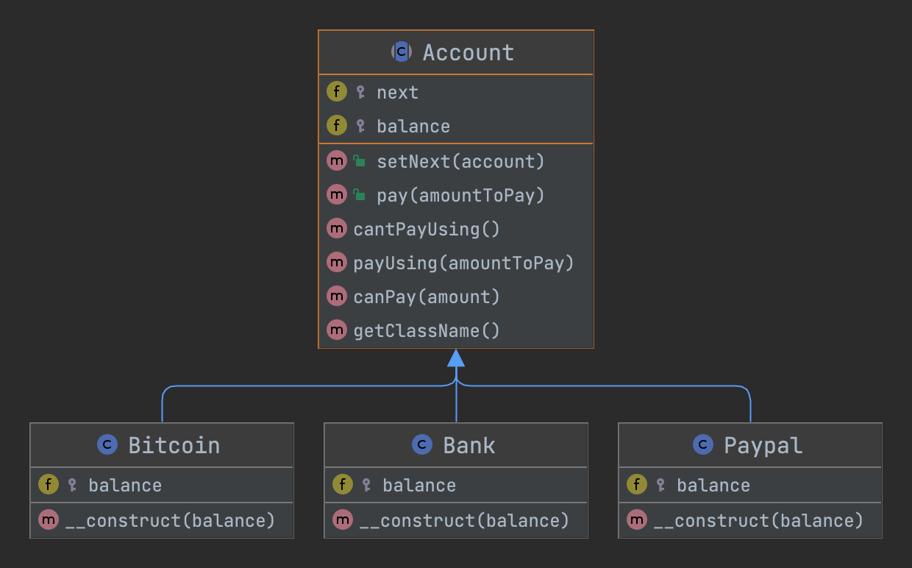

# 责任链模式 Chain Of Responsibility

## 概述
> 通俗解释：它有助于构建一系列对象。请求从一端进入并持续从一个对象到另一个对象，直到找到合适的处理程序。

> 维基百科：在面向对象的设计中，责任链模式是一种由命令对象源和一系列处理对象组成的设计模式。每个处理对象都包含定义它可以处理的命令对象类型的逻辑; 其余的传递给链中的下一个处理对象。

> 使用场景：略。

## 类图
