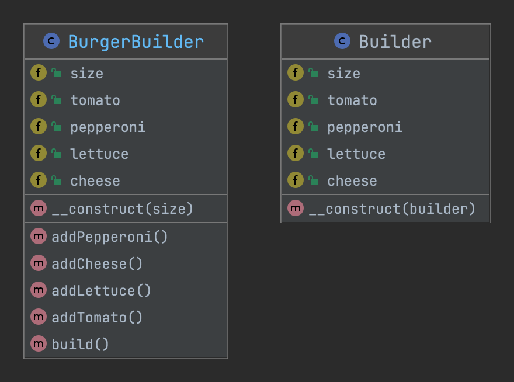

# 建造者模式 Builder

## 概述
> 通俗解释：允许您创建不同风格的对象，同时避免构造函数污染。当一个对象有多种风格时很有用。或者当一个对象创建时涉及很多步骤。

> 维基百科：建造者模式是一种创建对象的软件设计模式，其目的是找到伸缩构造器反模式的解决方案。

> 使用场景：当一个对象可能存在几种类型并避免构造函数伸缩时使用。与工厂模式的主要区别在于：当创建是一步过程时，将使用工厂模式，而当创建是多步骤过程时，将使用建造者模式。

## 类图

