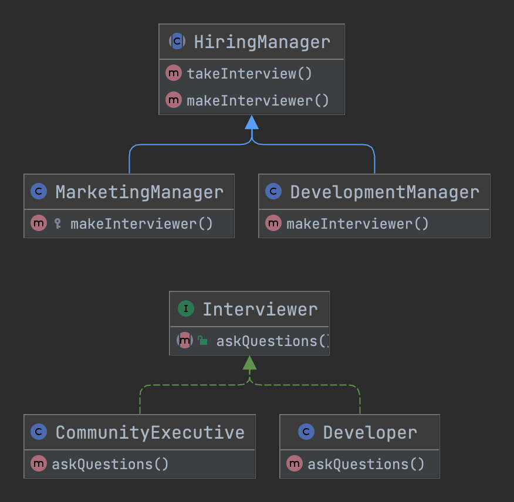

# 工厂方法模式 Factory Method

## 概述
> 通俗解释：它提供了一种将实例化逻辑委托给子类的方法。

> 维基百科：在基于类的编程中，工厂方法模式是一种创建模式，它使用工厂方法来处理创建对象的问题，而无需指定将要创建的对象的确切类。这是通过调用工厂方法来创建对象来完成的 - 在接口中指定并由子类实现，或者在基类中实现并可选地由派生类覆盖 - 而不是通过调用构造函数。
 
> 使用场景：在类中有一些通用处理但在运行时动态决定所需的子类时很有用。换句话说，当客户端不知道它可能需要什么样的子类时。

## 类图

