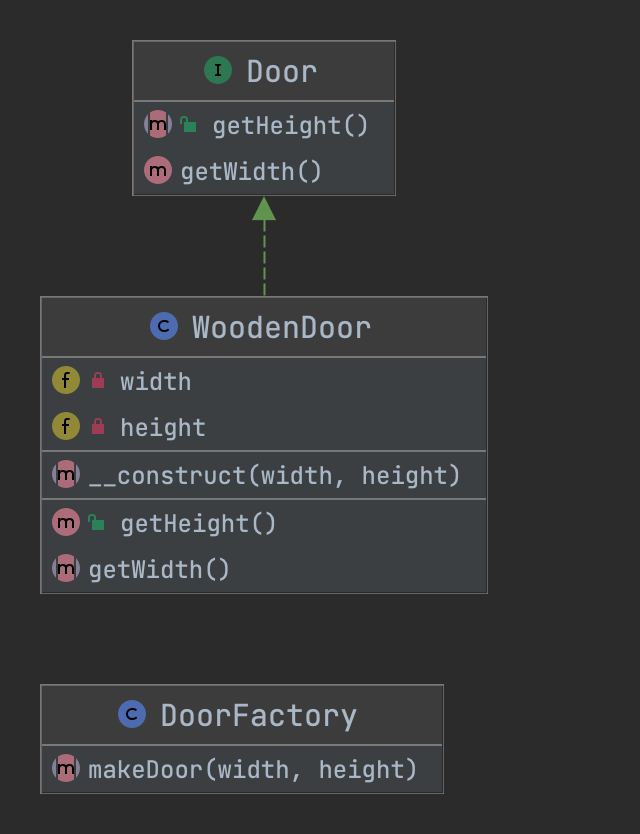

# 简单工厂模式 Simple Factory

## 概述
> 通俗解释：简单工厂只是为客户端生成一个实例，而不会向客户端公开任何实例化逻辑。

> 维基百科：在面向对象编程（OOP）中，工厂是用于创建其他对象的对象 - 正式工厂是一种函数或方法，它从一些方法调用返回变化的原型或类的对象，这被假定为“新”。

> 使用场景：当创建一个对象不仅仅是一些分配而且涉及一些逻辑时，将它放在专用工厂中而不是在任何地方重复相同的代码是有意义的。

## 类图
